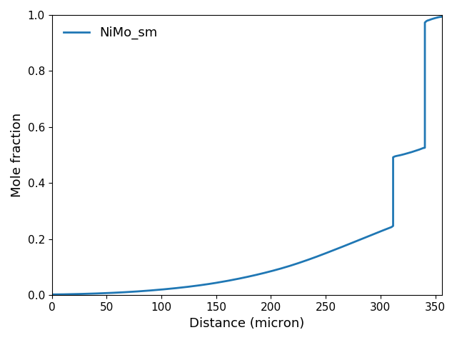
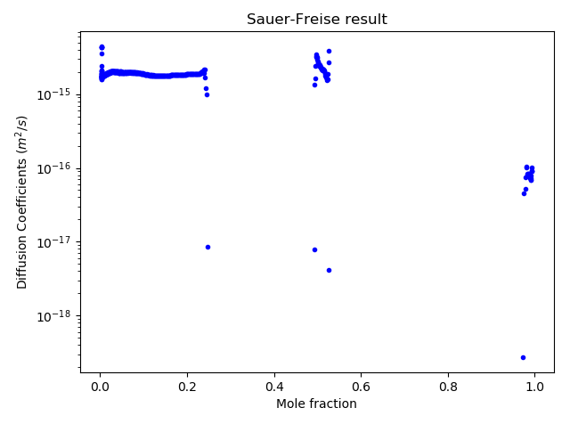
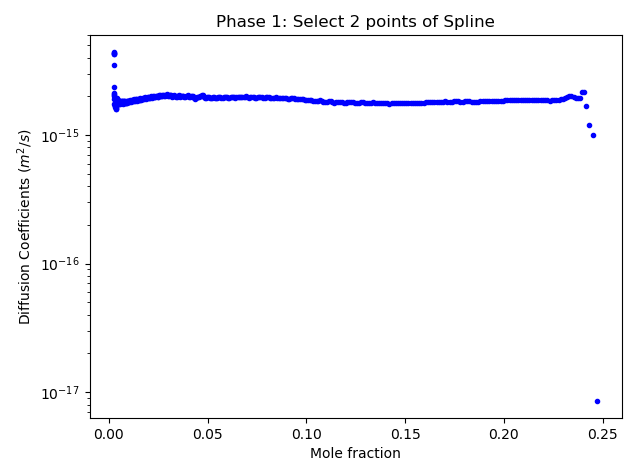
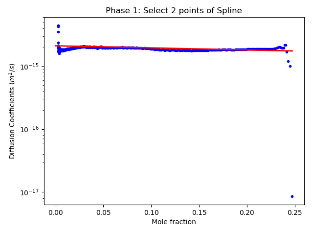
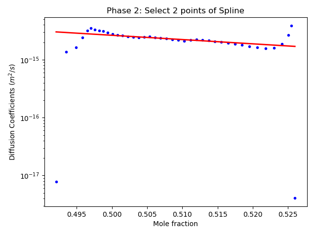
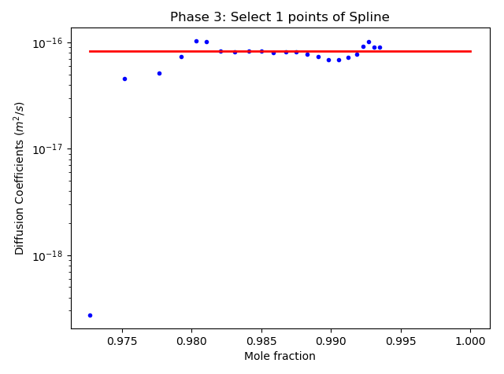
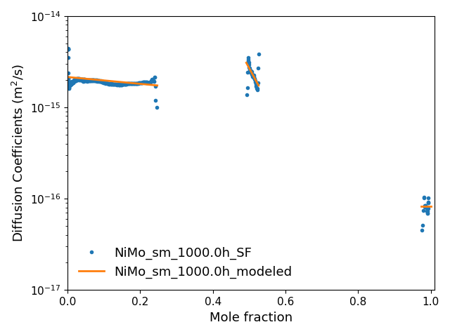

# Diffusion Coefficients (DC) Modeling

Before **Forward Simulation Analysis (FSA)**, an initial modeling of diffusion coefficients is required. It is recommend to perform data smoothing before DC modeling. DC modeling can be implemented by `pydiffusion.Dmodel.Dmodel`. (Currently doen't support `matplotlib inline`) Here is an example for DC modeling of smoothed Ni-Mo 1100C 1000 hours data.

```python
import matplotlib.pyplot as plt
from pydiffusion.io import read_csv
from pydiffusion.plot import profileplot, DCplot, SFplot
from pydiffusion.Dmodel import Dmodel
```

## Read smoothed profile data

Read smoothed profile data of Ni-Mo 1100C 1000 hours.

```python
NiMo_sm, _ = read_csv('examples/NiMo_sm.csv')

ax = plt.figure(figsize=(8, 6)).add_subplot(111)
profileplot(NiMo_sm, ax)
plt.show()
```



## DC modeling manually

DCmodeling is implemented by `pydiffusion.Dmodel.Dmodel` function. Time in seconds is required as input.

```python
time = 1000 * 3600
diffsys_init = Dmodel(NiMo_sm, time, Xlim=[0, 1])
```



```
Use Spline (y) or UnivariateSpline (n) to model diffusion coefficients? [y]

```

At first, the function asks using whether **Spline** or **UnivariateSpline**:

**Spline**: Need to select points (>0) as reference points for spline fitting. Can use both **Point Mode** and **Phase Mode** in the following **Forward Simulation Analysis (FSA)**.

**UnivariateSpline**: Need to select range (2 points) for reliable data fitting. Can only use **Phase Mode** in the following **FSA**.

(Please see definitions of **Point Mode** and **Phase Mode** in **FSA** example)

In this example, we are using Spline method for all of 3 phases.

Then program will ask you enter the number of points for **Spline** function of the current phase. Different number of points will create different **Spline** function.

Number of points | Spline function
---------------- | ---------------
1 | Constant
2 | linear
\>2 | Spline with order=2

```
# of spline points: 1 (constant), 2 (linear), >2 (spline)
input # of spline points
2
```

Then # of points must be selected on the figure:



You can redo the modeling if you want.

```
Continue to next phase? [y]
```

Spline for phase 1:



```
# of spline points: 1 (constant), 2 (linear), >2 (spline)
input # of spline points
2
Continue to next phase? [y]
```

Spline for phase 2:



```
# of spline points: 1 (constant), 2 (linear), >2 (spline)
input # of spline points
1
Continue to next phase? [y]
```

Spline for phase 3:



```
DC modeling finished, Xspl info:
[[0.05759519125648957, 0.17265729768975802], [0.50242048811055617, 0.51836224278478515], [0.98405894820043416]]
```

For **UnivariateSpline** option, only 2 points is required to select for each phase.

Plot results:

```python
ax = plt.figure(figsize=(8, 6)).add_subplot(111)
SFplot(NiMo_sm, time, Xlim=[0, 1], ax=ax)
DCplot(diffsys_init, ax, c='r')
plt.show()
```



## DC modeling automatically

`Dmodel` function can also automatically model the diffusion coefficients if `Xspl` is provided. You only need to choose from either **Spline** or **UnivariateSpline** during DC modeling.

```python
Xspl = [[.05, .2],
        [.5, .515],
        [.985]]
diffsys_init_auto = Dmodel(NiMo_sm, time, Xspl=Xspl, Xlim=[0, 1])
```