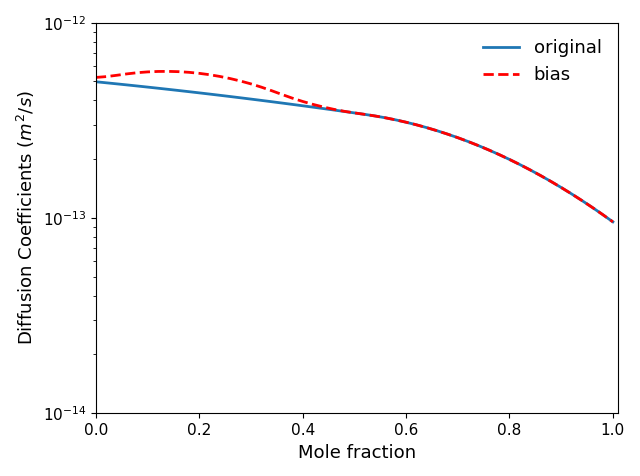
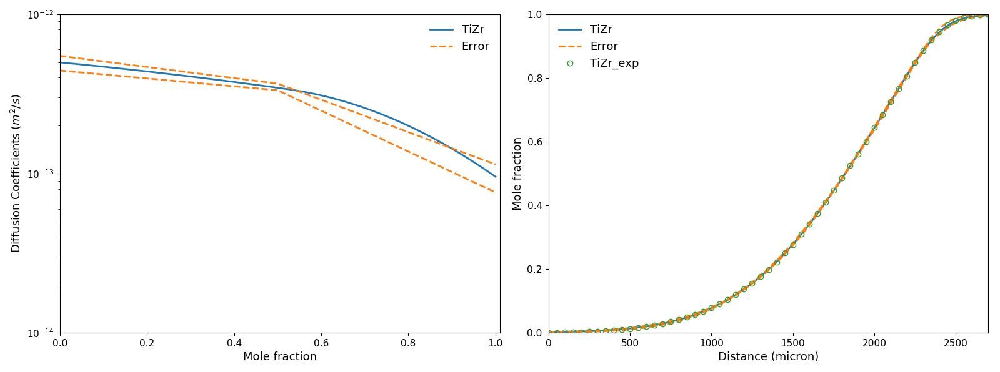

# Error Analysis of Diffusion Coefficients Data

Here is an example of how to analyze the uncertainty of diffusion coefficients data using `pydiffusion.simulation.ErrorAnalysis`

```python
import matplotlib.pyplot as plt
from pydiffusion.io import read_csv
from pydiffusion.utils import step, automesh, matanocalc, DCbias
from pydiffusion.simulation import ErrorAnalysis
from pydiffusion.plot import DCplot
```

## Definition of Error

The error is analyzed by creating a bias on diffusion coefficients, this can be done by `pydiffusion.utils.DCbias` function. Here is an example of creating bias at X = 0.2 in TiZr diffusion coefficients.

```python
profile_fsa, diffsys_TiZr = read_csv('examples/TiZr.csv', [0, 1])
profile_exp, _ = read_csv('examples/TiZr_exp.csv')
diffsys_bias = DCbias(diffsys_TiZr, 0.2, 0.1)

ax = plt.figure(figsize=(8, 6)).add_subplot(111)
DCplot(diffsys_TiZr, ax, label='original')
DCplot(diffsys_bias, ax, c='r', ls='--', label='bias')
plt.legend(fontsize=15)
plt.show()
```



## Error Analysis of Ti-Zr 1000C Diffusion Data

Here is an example showing error analysis of Ti-Zr 1000C data, calculating 3 positions at (0, 0.5, 1.0). Low accuracy this time.

```python
dism = automesh(profile_fsa, diffsys_TiZr, [300, 350])
mp = matanocalc(profile_fsa, [0, 1])
profile_init = step(dism, mp, diffsys_TiZr)
time = 100*3600
error_result = ErrorAnalysis(profile_exp, profile_init, diffsys_TiZr, time, loc=3, accuracy=1e-2)
```

The program will ask an input of cap error. Higher the cap, higher the bias will be calculated.

```
Meshing Num=337, Minimum grid=5.653367 um
Reference error=  0.001029. Input cap error: [ 0.001039].002
Cap error =  0.002000
At 0.000, simulation #1, deltaD = 0.500000, profile difference = 0.024898(0.002000)
At 0.000, simulation #2, deltaD = 0.020338, profile difference = 0.001376(0.002000)
At 0.000, simulation #3, deltaD = 0.033056, profile difference = 0.001741(0.002000)
At 0.000, simulation #4, deltaD = 0.038286, profile difference = 0.001907(0.002000)
At 0.000, simulation #5, deltaD = 0.040162, profile difference = 0.001972(0.002000)
At 0.000, simulation #6, deltaD = 0.040722, profile difference = 0.001992(0.002000)
Error (positive) at 0.000 = 0.040722, 6 simulations performed, profile difference = 0.001992
At 0.000, simulation #1, deltaD = -0.040722, profile difference = 0.001682(0.002000)
At 0.000, simulation #2, deltaD = -0.081444, profile difference = 0.003000(0.002000)
At 0.000, simulation #3, deltaD = -0.050535, profile difference = 0.001984(0.002000)
Error (negative) at 0.000 = -0.050535, 3 simulations performed, profile difference = 0.001984
At 0.500, simulation #1, deltaD = 0.050535, profile difference = 0.003980(0.002000)
At 0.500, simulation #2, deltaD = 0.016627, profile difference = 0.001299(0.002000)
At 0.500, simulation #3, deltaD = 0.025496, profile difference = 0.001953(0.002000)
At 0.500, simulation #4, deltaD = 0.026074, profile difference = 0.001998(0.002000)
Error (positive) at 0.500 = 0.026074, 4 simulations performed, profile difference = 0.001998
At 0.500, simulation #1, deltaD = -0.026074, profile difference = 0.002718(0.002000)
At 0.500, simulation #2, deltaD = -0.014991, profile difference = 0.001955(0.002000)
At 0.500, simulation #3, deltaD = -0.015648, profile difference = 0.002000(0.002000)
Error (negative) at 0.500 = -0.015648, 3 simulations performed, profile difference = 0.002000
At 1.000, simulation #1, deltaD = 0.015648, profile difference = 0.001144(0.002000)
At 1.000, simulation #2, deltaD = 0.031295, profile difference = 0.001328(0.002000)
At 1.000, simulation #3, deltaD = 0.062591, profile difference = 0.001778(0.002000)
At 1.000, simulation #4, deltaD = 0.125181, profile difference = 0.002863(0.002000)
At 1.000, simulation #5, deltaD = 0.075382, profile difference = 0.001973(0.002000)
At 1.000, simulation #6, deltaD = 0.076904, profile difference = 0.001998(0.002000)
Error (positive) at 1.000 = 0.076904, 6 simulations performed, profile difference = 0.001998
At 1.000, simulation #1, deltaD = -0.076904, profile difference = 0.001654(0.002000)
At 1.000, simulation #2, deltaD = -0.153807, profile difference = 0.002887(0.002000)
At 1.000, simulation #3, deltaD = -0.098494, profile difference = 0.001991(0.002000)
Error (negative) at 1.000 = -0.098494, 3 simulations performed, profile difference = 0.001991
Error analysis complete
```

Plot results

```python
ax = plt.figure(figsize=(8, 6)).add_subplot(111)
DCplot(diffsys_TiZr, ax, error_result)
plt.show()
```



The error bar is marked out around the original diffusion coefficients data. Next example we try more calculation points and high accuracy.

```python
error_result2 = ErrorAnalysis(profile_exp, profile_init, diffsys_TiZr, time, loc=21, accuracy=1e-3, output=False)

ax = plt.figure(figsize=(8, 6)).add_subplot(111)
DCplot(diffsys_TiZr, ax, error_result2)
plt.show()
```

```
Reference error=  0.001029. Input cap error: [ 0.001039].002
Cap error =  0.002000
Error (positive) at 0.000 = 0.040939, 8 simulations performed, profile difference = 0.001999
Error (negative) at 0.000 = -0.051030, 4 simulations performed, profile difference = 0.001999
Error (positive) at 0.050 = 0.031481, 4 simulations performed, profile difference = 0.001999
Error (negative) at 0.050 = -0.037261, 4 simulations performed, profile difference = 0.001999
Error (positive) at 0.100 = 0.026793, 4 simulations performed, profile difference = 0.001999
Error (negative) at 0.100 = -0.029648, 4 simulations performed, profile difference = 0.001999
Error (positive) at 0.150 = 0.023722, 4 simulations performed, profile difference = 0.002000
Error (negative) at 0.150 = -0.025324, 4 simulations performed, profile difference = 0.002000
Error (positive) at 0.200 = 0.022054, 3 simulations performed, profile difference = 0.002000
Error (negative) at 0.200 = -0.022245, 3 simulations performed, profile difference = 0.002000
Error (positive) at 0.250 = 0.021606, 3 simulations performed, profile difference = 0.002000
Error (negative) at 0.250 = -0.020141, 3 simulations performed, profile difference = 0.002000
Error (positive) at 0.300 = 0.021791, 4 simulations performed, profile difference = 0.002000
Error (negative) at 0.300 = -0.018476, 3 simulations performed, profile difference = 0.002000
Error (positive) at 0.350 = 0.022895, 4 simulations performed, profile difference = 0.001999
Error (negative) at 0.350 = -0.017589, 4 simulations performed, profile difference = 0.002000
Error (positive) at 0.400 = 0.024581, 5 simulations performed, profile difference = 0.002000
Error (negative) at 0.400 = -0.017005, 3 simulations performed, profile difference = 0.002000
Error (positive) at 0.450 = 0.025304, 4 simulations performed, profile difference = 0.001999
Error (negative) at 0.450 = -0.016211, 4 simulations performed, profile difference = 0.002000
Error (positive) at 0.500 = 0.026098, 4 simulations performed, profile difference = 0.002000
Error (negative) at 0.500 = -0.015648, 3 simulations performed, profile difference = 0.002000
Error (positive) at 0.550 = 0.027747, 4 simulations performed, profile difference = 0.002000
Error (negative) at 0.550 = -0.015897, 3 simulations performed, profile difference = 0.001999
Error (positive) at 0.600 = 0.029100, 4 simulations performed, profile difference = 0.002000
Error (negative) at 0.600 = -0.017100, 3 simulations performed, profile difference = 0.001998
Error (positive) at 0.650 = 0.030079, 4 simulations performed, profile difference = 0.002000
Error (negative) at 0.650 = -0.019340, 4 simulations performed, profile difference = 0.002000
Error (positive) at 0.700 = 0.032644, 4 simulations performed, profile difference = 0.002000
Error (negative) at 0.700 = -0.021295, 4 simulations performed, profile difference = 0.002000
Error (positive) at 0.750 = 0.035065, 4 simulations performed, profile difference = 0.001999
Error (negative) at 0.750 = -0.024158, 3 simulations performed, profile difference = 0.002001
Error (positive) at 0.800 = 0.038058, 4 simulations performed, profile difference = 0.001999
Error (negative) at 0.800 = -0.028804, 4 simulations performed, profile difference = 0.002000
Error (positive) at 0.850 = 0.041325, 5 simulations performed, profile difference = 0.002000
Error (negative) at 0.850 = -0.035934, 3 simulations performed, profile difference = 0.002000
Error (positive) at 0.900 = 0.046970, 5 simulations performed, profile difference = 0.001999
Error (negative) at 0.900 = -0.046637, 3 simulations performed, profile difference = 0.002000
Error (positive) at 0.950 = 0.058243, 5 simulations performed, profile difference = 0.001999
Error (negative) at 0.950 = -0.064287, 4 simulations performed, profile difference = 0.002000
Error (positive) at 1.000 = 0.077021, 5 simulations performed, profile difference = 0.002000
Error (negative) at 1.000 = -0.099025, 4 simulations performed, profile difference = 0.002000
Error analysis complete
```

